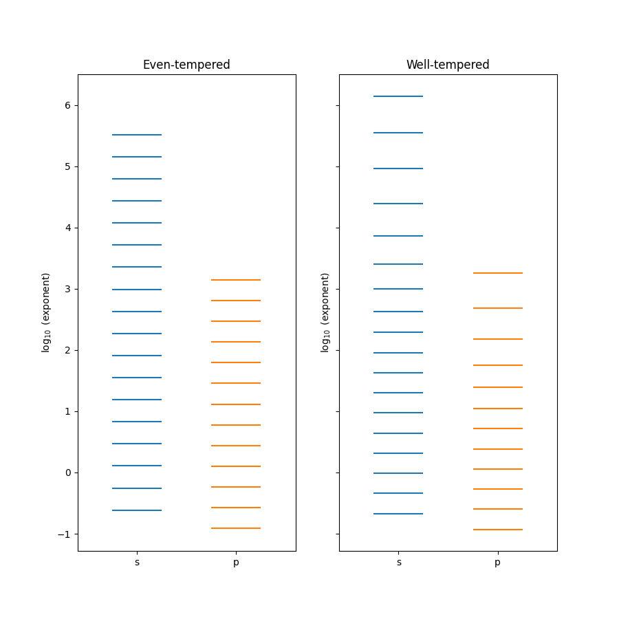

:orphan:
.. _`sec:cpmareetwt`:

====================================================
Comparing even-tempered and well-tempered basis sets
====================================================

This tutorial compares an even-tempered basis set for the neon atom with an equivalent well-tempered basis set, both in terms of
the SCF energy and the exponents that arrise from the expansions. An example script can also be found in 
``examples/et_wt_compare.py``.

An even-tempered basis set
--------------------------

We use the same procedure for optimizing an even-tempered basis set as in the :ref:`sec:eventemper` example,
please see that tutorial for further details of how to perform this in BasisOpt. An even-tempered expansion of :math:`n` exponents 
is defined as:

.. math::

   \alpha_n = \alpha_0 k^{n-1}

where :math:`\alpha_0` and :math:`k` are the two variables to be optimized. These can be thought of as the initial (most diffuse)
exponent and the spacing between all subsequent exponents, respectively. By following the even-tempered example
and running the following optimization with the Psi4 backend

.. code-block:: python

	ne_et.set_even_tempered(method='scf', accuracy=1e-4)
	
We should get results that look very similar to::

        l = 0: (0.24303219077706045, 2.295167745669027, 18)
        l = 1: (0.12199362316666561, 2.180056874861101, 13)

where the first value in parentheses corresponds to the optimized :math:`\alpha_0`, the second value is :math:`k`,
and the final integer is the number of functions that were required to reach the desired accuracy.

A well-tempered basis set
-------------------------

A well-tempered basis set builds upon the even-tempered basis by introducing two additional parameters, such that 
the expansion is defined as:

.. math::

   \alpha_n = \alpha_0 k^{n-1} [1 + \gamma(n / N)^{\delta}]

where :math:`N` is the total number of primitive exponents in the expansion, and :math:`\gamma` and :math:`\delta` are the
additional variables to be optimized. 

A well-tempered Atomic Basis can be optimized in a similar fashion as the even-tempered example. A full example input is
provided in ``examples/wt_strategy.py``, but perhaps the most important part is:

.. code-block:: python

	ne_wt.set_well_tempered(method='scf', accuracy=1e-4)

The results should look similar to::

        l = 0: (0.21397184263141658, 2.129617983476232, 16.3786689342292, 11.79947009544172, 18)
        l = 1: (0.11831666016132977, 2.130099585140868, 2.7477960324041435, 10.480981519305843, 12)

A comparison of the above with the optimized even-tempered parameters shows that there are
some minor changes in the initial exponent and first spacing parameter. Perhaps more significant is that only 12 p-type
functions were required to reach the desired accuracy, rather than 13 in the even-tempered case. The effect of the third
and fourth parameters (those introduced in the well-tempered expansion) are perhaps better visualised.

Visualising the exponents
-------------------------

In this tutorial example, we create a Internal Basis object as a data structure for storing and comparing the even- and
well-tempered basis sets:

.. code-block:: python

	viz_basis = InternalBasis()
	viz_basis['even'] = ne_et.get_basis()['ne']
	viz_basis['well'] = ne_wt.get_basis()['ne']

We then plot the exponents using a similar process as for the :ref:`sec:visualize` example.

.. code-block:: python

	fig, ax = plot_exponents(viz_basis, atoms=['even', 'well'], split_by_shell=True)
	ax[0].set_title('Even-tempered')
	ax[1].set_title('Well-tempered')
	
Once the plot is saved, the resulting image should look like the following.

	
The effect of using a well-tempered expansion is particularly clear for the s shell - it can be seen that as the exponent value
increases (becomes tighter), the spacing between the exponents increases. For the p shell the exponents from the well-tempered expansion
still span a similar range as from even-tempered, even though there is one fewer function.

Effect on energy
----------------

The resulting neon SCF energies are::

        Even-tempered energy: -128.54704832
        Well-tempered energy: -128.54708446
        Numerical SCF energy: -128.54709811

We can see that switching to a well-tempered scheme lowers the energy by roughly 36 :math:`\mu E_h` and is significantly closer to the
numerical SCF result, despite having one fewer p function.

.. toctree::
   :hidden:
   