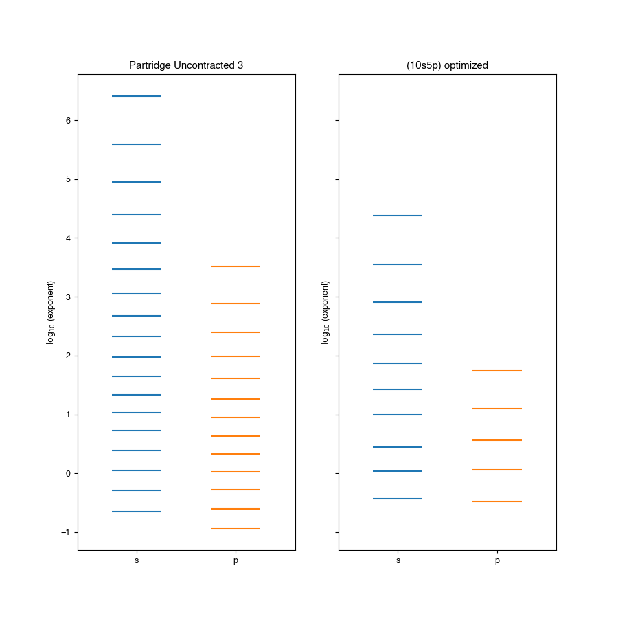

:orphan:
.. _`sec:visualize`:

=================================
Plotting basis function exponents
=================================

This tutorial demonstrates some of the visualization capabilities of BasisOpt, which relies on `Matplotlib <https://matplotlib.org>`_. In particular, we will use an event plot to compare the exponents for the Partridge Uncontracted 3 basis to the (10s5p) basis created in the :ref:`sec:reduce` example. The full example script can be found in ``examples/reduce/viz_exponents.py``.

This tutorial also demonstrates how a BasisOpt generated json file can be read in and used for further analysis.

Loading a basis from a json file
--------------------------------

We begin by loading the json file generated during one of the previous tutorials. This file can be found in ``examples/reduce/neon-reduce.py``.

.. code-block:: python

	ne = bo.read_json("neon-reduce.json")

We also fetch the Partridge Uncontracted 3 basis from the Basis Set Exchange.

.. code-block:: python

	from basisopt.bse_wrapper import fetch_basis
	basis_name = 'Partridge Uncontracted 3'
	start_basis = fetch_basis(basis_name, ['Ne'])
	start_basis['partridge'] = start_basis['ne']
	start_basis['optimized'] = ne.get_basis()['ne']

Visualization 
-------------

We now generate the comparison between the starting Partridge Uncontracted 3 set and the (10s5p) basis that results from the reduction/optimization. 

.. code-block:: python

	import matplotlib.pyplot as plt
	from basisopt.viz.basis import plot_exponents
	fig, ax = plot_exponents(start_basis, atoms=['partridge', 'optimized'], split_by_shell=True)

As the plots are Matplotlib objects, they can be adjusted using the standard syntax. Here we add some titles and output as a PNG.

.. code-block:: python

	ax[0].set_title('Partridge Uncontracted 3')
	ax[1].set_title('(10s5p) optimized')
	plt.savefig('basis_plot.png')

The resulting image is shown below.

.. toctree::
   :hidden:
